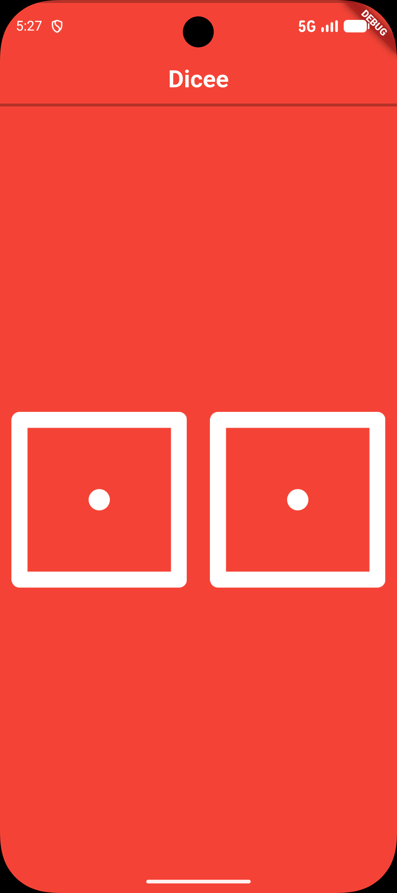
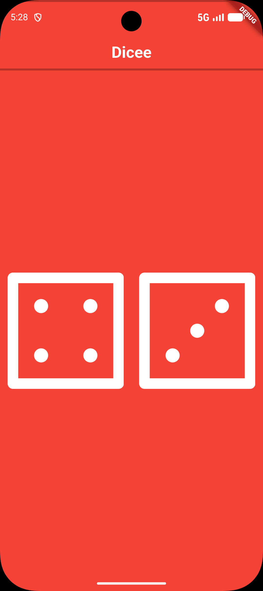

# Dicee

A simple two-dice roller built with Flutter. Tap either die to re-roll both.

## Screenshots

  
  

## Features

- Two independent dice, each showing a random 1–6 face
- Tap either die image to roll both

## Getting Started

This is a standard Flutter project.

1. Install [Flutter](https://docs.flutter.dev/get-started/install)
2. Clone this repo and run:
   ```
   flutter pub get
   flutter run
   ```
